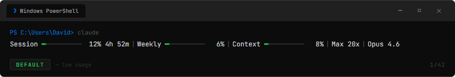

<p align="center">
  <h1 align="center">claude-pulse</h1>
  <p align="center">A real-time usage monitor for Claude Code — see your limits at a glance.</p>
</p>

<p align="center">
  
  <br>
  <sub>10 built-in themes with colour-coded bars that shift green → yellow → red as usage increases</sub>
</p>

<p align="center">
  
  <br>
  <sub>Rainbow animation — enable with <code>/pulse animate on</code> or <code>--animate on</code></sub>
</p>

<p align="center">
  
  <br>
  <sub>Automatic update notification — appears when a new version is available</sub>
</p>

---

> **Works with any Claude subscription** — Pro (£18/mo), Max 5x (£90/mo), or Max 20x (£180/mo). No API key required. Auto-detects your plan and reflects the exact usage shown on [claude.ai/settings/usage](https://claude.ai/settings/usage).

---

## What is this?

**claude-pulse** adds a live status bar to the bottom of your Claude Code CLI window showing:

- **Session usage** — how much of your current 5-hour block you've used
- **Time remaining** — countdown until your session resets
- **Weekly usage** — your 7-day rolling usage across all models
- **Context window** — how full Claude's memory/context is (with colour-coded bar)
- **Model name** — which model is active (Opus 4.6, Sonnet 4.5, etc.)
- **Plan tier** — auto-detected (Pro, Max 5x, Max 20x)
- **Extra credits** — auto-shows when you have credits enabled in https://claude.ai/settings/usage

No guesswork. No scanning log files. It pulls the **exact same numbers** shown on [claude.ai/settings/usage](https://claude.ai/settings/usage) via Anthropic's OAuth API — the same authentication you already use when logged into Claude Code.

## Quick Start — `/pulse`

Once installed, just type **`/pulse`** in Claude Code. That's it. A guided wizard walks you through picking a theme, text colour, and animation settings — no commands to remember.

```
/pulse          — opens the interactive setup wizard
/pulse show     — preview all themes and text colours
/pulse ocean    — jump straight to a theme by name
/pulse config   — see your current settings
/pulse update   — pull the latest version from GitHub
```

Everything below can also be configured via `/pulse` — the CLI flags are there if you prefer them.

---

## Features

### Colour-coded progress bars

The bars change colour based on your usage level so you can tell at a glance how close you are to your limits:

| Usage | Colour | Meaning |
|-------|--------|---------|
| 0-49% | Green | Plenty of headroom |
| 50-79% | Yellow | Getting warm |
| 80%+ | Red | Close to the limit |

This applies to all bars — session, weekly, context window, and extra credits.

### 10 Built-in Themes

<p align="center">
  
</p>

Each theme uses accent colours for text and colour-coded progress bars that shift from **low** to **mid** to **high** based on your usage. The `rainbow` theme applies a full-spectrum colour gradient across the entire status line.

Preview them live in Claude Code with `/pulse show`, or from the command line with `python claude_status.py --show-themes`.

### Rainbow Animation

Turn on animation and rainbow colours flow across your status bar while Claude is active:

```bash
# Enable rainbow animation (works with any theme)
python claude_status.py --animate on

# Turn it off — static theme colours
python claude_status.py --animate off
```

Animation is purely refresh-based — no hooks, no background processes, no daemons. It works by rendering a new rainbow frame each time Claude Code refreshes the status line (~150ms while active). Animation is **off by default** — enable it via `/pulse` setup or `--animate on`.

### Context Window & Model Name

See how full Claude's context/memory is and which model you're running, right in the status bar:

```
Session ━━━━━━━━ 12% 3h 40m | Weekly ━━━━━━━━ 12% | Context ━━━━━━━━ 42% | Max 20x | Opus 4.6
```

Both are **enabled by default**. The context bar uses the same colour-coded theme as your other bars. Context and model data appear after your first message in a session (Claude Code provides this data via stdin).

### Text Colour

The labels and percentages outside the progress bars use a configurable text colour:

```bash
# Use the theme's recommended colour (default)
python claude_status.py --text-color auto

# Pick a specific colour
python claude_status.py --text-color cyan
python claude_status.py --text-color magenta
```

**Available colours:** `auto`, `white`, `bright_white`, `cyan`, `blue`, `green`, `yellow`, `magenta`, `red`, `orange`, `violet`, `pink`, `dim`, `default`, `none`

Preview all themes and text colours live in Claude Code:
```
/pulse show
```

Set a theme:
```bash
python claude_status.py --theme ocean
```

### Configurable Bar Size

Choose how wide the progress bars appear — small (4 chars), medium (8 chars, default), or large (12 chars):

```bash
python claude_status.py --bar-size small    # ━━━━
python claude_status.py --bar-size medium   # ━━━━━━━━
python claude_status.py --bar-size large    # ━━━━━━━━━━━━
```

The bars automatically clamp to your terminal width so they never wrap to the next line.

### Extra Credits (Auto-detected)

When Claude gifts you bonus credits (e.g. to try a new model), they **automatically appear** on your status line:

```
Session ━━━━━━━━ 5% 4h 07m | Weekly ━━━━━━━━ 6% | Extra ━━━━━━━━ £37.33/£37.00 | Max 20x
```

- **Automatic** — appears when credits are active in your account, no setup needed
- **Hideable** — `--hide extra` to suppress, `--show extra` to bring back
- **Currency** — defaults to `£`, change with `--currency $` or `--currency €`

### Visibility Toggles

Show or hide individual parts of the status line:

```bash
# Hide the timer and plan name
python claude_status.py --hide timer,plan

# Show them again
python claude_status.py --show timer,plan

# See current config
python claude_status.py --config
```

**Available parts:** `session`, `weekly`, `plan`, `timer`, `extra`, `update`, `claude_update`, `sparkline`, `runway`, `status_message`, `streak`, `model`, `context`

### `/pulse` Slash Command

All the CLI flags below also work as `/pulse` subcommands inside Claude Code:

```
/pulse visibility       — toggle which parts are visible
/pulse hide timer       — hide the reset timer
/pulse show extra       — show extra credits on the status line
/pulse hide extra       — hide extra credits
/pulse currency £       — set your currency symbol
/pulse animate on       — enable rainbow animation on any theme
/pulse animate off      — disable animation (static colours)
/pulse bar-size large   — set progress bar width
/pulse bar-style block  — set bar character style
/pulse layout compact   — set text layout
/pulse text-color cyan  — set text colour to cyan
/pulse update           — pull the latest version from GitHub
/pulse config           — see your current settings and credit status
```

### Automatic Update Notifications

claude-pulse checks GitHub for new releases once per hour (cached, 3-second timeout). If a newer version is available, a bright yellow `↑ Pulse Update` indicator appears on your status line.

Update right from Claude Code:
```
/pulse update    — pulls the latest version automatically
```

Or from the command line:
```bash
python claude_status.py --update
```

### Claude Code Update Indicator

claude-pulse also checks if your Claude Code CLI is outdated by querying the npm registry once per hour (cached, 3-second timeout). If a newer version is available, a bright yellow `↑ Claude Update` indicator appears alongside your status line.

- **Automatic** — checks `claude --version` against the latest npm release
- **Hideable** — `--hide claude_update` to suppress, `--show claude_update` to bring back
- **No action needed** — it's just an indicator; update Claude Code yourself when ready

### Lightweight and fast

- **Single Python file** — no dependencies, no pip install, just Python 3.6+
- **30-second cache** — API is only called once every 30 seconds, cached responses return instantly. Configurable: set `cache_ttl_seconds` in your config
- **Zero config needed** — auto-detects your plan and credentials from Claude Code
- **No hooks or background processes** — animation runs purely on the status line refresh cycle

### Auto-detected plan

Reads your subscription tier directly from Claude Code's credentials file. Supports:
- **Pro** ($20/mo) — standard plan
- **Max 5x** — 5x Pro usage
- **Max 20x** — 20x Pro usage

If you upgrade your plan, just restart Claude Code and it picks up the new tier automatically.

## Installation

### Option A — Plugin Marketplace

> **Coming soon** — claude-pulse has been submitted to the Claude Code Plugin Directory and is pending review. Once accepted, you'll be able to install with the commands below. For now, use **Option B** (manual install).

```
/plugin marketplace add NoobyGains/claude-pulse
/plugin install claude-pulse@claude-pulse
/claude-pulse:setup
```

Restart Claude Code. Done! Use `/claude-pulse:pulse` to configure themes.

### Option B — Manual Install (recommended for now)

#### 1. Clone the repo

```bash
git clone https://github.com/NoobyGains/claude-pulse.git
cd claude-pulse
```

#### 2. Install the status line

```bash
python claude_status.py --install
```

This adds the status line command to your `~/.claude/settings.json`.

#### 3. Restart Claude Code

Close and reopen Claude Code. The status bar appears at the bottom of your terminal.

That's it. No virtual environments, no dependencies, no build steps.

#### 4. (Optional) Install the slash command

Copy the pulse command file to your Claude Code commands directory:

```bash
# Linux/Mac
cp pulse.md ~/.claude/commands/pulse.md

# Windows
copy pulse.md %USERPROFILE%\.claude\commands\pulse.md
```

Now you can use `/pulse` inside Claude Code to configure themes and visibility.

## How it works

```
Claude Code starts
    ↓
Calls claude_status.py (passes session JSON via stdin)
    ↓
Check cache (~30s TTL)
    ├── Fresh? → Re-render with current stdin context (model, context %)
    └── Stale? → Read OAuth token from ~/.claude/.credentials.json
                     ↓
                 GET https://api.anthropic.com/api/oauth/usage
                     ↓
                 Format status line with coloured bars
                     ↓
                 Cache result, print to stdout

Animation (when enabled):
    Each refresh → rainbow_colorize() shifts the hue based on time.time()
    Result: smooth flowing rainbow that moves while Claude refreshes (~150ms)
    When idle: Claude Code stops refreshing → animation pauses naturally
```

## Configuration

Edit `config.json` directly or use the CLI flags:

```json
{
  "cache_ttl_seconds": 30,
  "theme": "default",
  "animate": false,
  "text_color": "auto",
  "currency": "£",
  "bar_size": "medium",
  "bar_style": "classic",
  "layout": "standard",
  "context_format": "percent",
  "extra_display": "auto",
  "show": {
    "session": true,
    "weekly": true,
    "plan": true,
    "timer": true,
    "extra": false,
    "update": true,
    "claude_update": true,
    "sparkline": false,
    "runway": false,
    "status_message": false,
    "streak": false,
    "model": true,
    "context": true
  }
}
```

### CLI Flags

| Flag | Description |
|------|-------------|
| `--install` | Install status line into Claude Code settings |
| `--show-all` | Preview all themes and text colours with live samples |
| `--themes` | List all available themes with colour previews |
| `--themes-demo` | Preview all themes with simulated status lines |
| `--theme <name>` | Set the active theme |
| `--show <parts>` | Enable comma-separated parts |
| `--hide <parts>` | Disable comma-separated parts |
| `--animate on\|off` | Toggle rainbow animation (default: off) |
| `--text-color <name>` | Set the text colour for labels/percentages (default: auto) |
| `--bar-size <small\|medium\|large>` | Set progress bar width: 4, 8, or 12 chars (default: medium) |
| `--bar-style <name>` | Set bar character style (default: classic) |
| `--layout <name>` | Set text layout (default: standard) |
| `--currency <symbol>` | Set currency symbol for extra credits (default: £) |
| `--extra-display <auto\|full\|amount>` | Extra credits display mode (default: auto) |
| `--update` | Pull the latest version from GitHub (shows changelog) |
| `--config` | Print current configuration summary |

### Cache TTL

The `cache_ttl_seconds` setting controls how often the API is called. Recommended values:

| Value | API calls/hour | Best for |
|-------|---------------|----------|
| `30` | ~120 | **Default** — frequent updates, active sessions |
| `60` | ~60 | Good balance |
| `80` | ~45 | Light usage |
| `120` | ~30 | Minimal API calls |

Lower values = more frequent API calls. Higher values = faster response but slightly staler data.

## Requirements

- **Python 3.6+** (no external packages)
- **Claude Code** with an active subscription (Pro, Max 5x, or Max 20x)
- **Windows, macOS, or Linux**

No API key required — claude-pulse uses your existing Claude Code login (OAuth), not the Anthropic API.

## Troubleshooting

| Problem | Solution |
|---------|----------|
| Status line doesn't appear | Run `python claude_status.py --install` and restart Claude Code |
| Shows "No credentials found" | Make sure you're logged in to Claude Code (`claude /login`) |
| Shows wrong plan tier after upgrading | Log out (`claude /logout`) then log back in (`claude /login`) — your OAuth token needs to refresh to pick up the new subscription tier |
| Stale percentages | Delete the cache: `~/.cache/claude-status/cache.json` (Linux/Mac) or `%LOCALAPPDATA%\claude-status\cache.json` (Windows) |
| Theme not applying | Clear the cache file after changing themes so the next render uses the new colours |
| Context/model not showing | Context and model appear after your first message — Claude Code provides this data via stdin once the session is active |
| `↑ Pulse Update` showing | Run `/pulse update` in Claude Code, or `python claude_status.py --update` from the command line. To hide the notification: `--hide update` |
| `↑ Claude Update` showing | Update Claude Code with `npm update -g @anthropic-ai/claude-code`. To hide the notification: `--hide claude_update` |

## Extra Features

### Bar Styles

Change the visual appearance of the progress bars:

| Style | Filled | Empty | Look |
|-------|--------|-------|------|
| `classic` | ━ | ─ | Thin line (default) |
| `block` | █ | ░ | Thick/chunky |
| `shade` | ▓ | ░ | Medium shaded |
| `pipe` | ┃ | ┊ | Vertical segments |
| `dot` | ● | ○ | Round dots |
| `square` | ■ | □ | Filled/hollow squares |
| `star` | ★ | ☆ | Stars |

```bash
python claude_status.py --bar-style classic
python claude_status.py --bar-style block
python claude_status.py --bar-style dot
```

Bar styles work with all themes, sizes, and animations.

### Text Layouts

Change how labels, bars, and percentages are arranged:

| Layout | Example |
|--------|---------|
| `standard` | `Session ━━━━━━━━ 42% 3h 12m \| Weekly ━━━━━━━━ 67% \| Max 20x` |
| `compact` | `S ━━━━━━━━ 42% 3h 12m \| W ━━━━━━━━ 67% \| Max 20x` |
| `minimal` | `━━━━━━━━ 42% \| ━━━━━━━━ 67%` |
| `percent-first` | `42% ━━━━━━━━ 3h 12m \| 67% ━━━━━━━━ \| Max 20x` |

```bash
python claude_status.py --layout compact
python claude_status.py --layout minimal
python claude_status.py --layout percent-first
python claude_status.py --layout standard
```

Layouts work with all themes, bar sizes, bar styles, and animations.

## Upgrading from v2.1.x

v2.2.0 simplifies animation and removes hooks:

- **Hooks are removed automatically** — the first run after upgrading cleans any claude-pulse hooks from your `settings.json`
- **`rainbow_mode` and `rainbow_bars` settings removed** — replaced by a single `--animate on/off` toggle
- **`--animate on`** = rainbow colours flow across the status bar (any theme)
- **`--animate off`** = static theme colours (default)
- **Context window and model name** now shown by default

No action needed — the upgrade is automatic when you run `/pulse update`.

## License

MIT License. See [LICENSE](LICENSE) for details.

---

## Star History

<a href="https://star-history.com/#NoobyGains/claude-pulse&Date">
 <picture>
   <source media="(prefers-color-scheme: dark)" srcset="https://api.star-history.com/svg?repos=NoobyGains/claude-pulse&type=Date&theme=dark&v=20260208" />
   <source media="(prefers-color-scheme: light)" srcset="https://api.star-history.com/svg?repos=NoobyGains/claude-pulse&type=Date&v=20260208" />
   
 </picture>
</a>

---

## Support

If claude-pulse is useful to you, consider buying me a coffee:

[](https://buymeacoffee.com/noobygains)

---

<p align="center">
  Made by <a href="https://www.reddit.com/user/PigeonDroid/">PigeonDroid</a>
</p>
