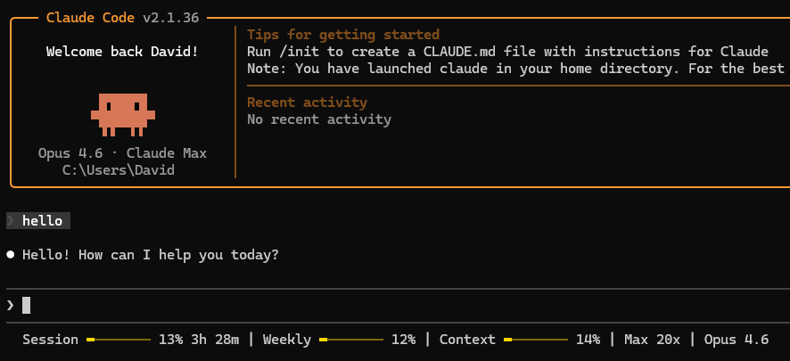

<p align="center">
  <h1 align="center">claude-pulse</h1>
  <p align="center">A real-time usage monitor for Claude Code — see your limits at a glance.</p>
</p>

<p align="center">
  
</p>

<p align="center">
  <code>Session ━━────── 23% 2h 06m | Weekly ──────── 4% | Max 20x</code>
</p>

---

## What is this?

**claude-pulse** adds a live status bar to the bottom of your Claude Code CLI window showing:

- **Session usage** — how much of your current 5-hour block you've used
- **Time remaining** — countdown until your session resets
- **Weekly usage** — your 7-day rolling usage across all models
- **Plan tier** — auto-detected (Pro, Max 5x, Max 20x)
- **Extra usage** — optional bonus/overflow credit tracking

No guesswork. No scanning log files. It pulls the **exact same numbers** shown on [claude.ai/settings/usage](https://claude.ai/settings/usage) via Anthropic's OAuth API.

## Features

### Colour-coded progress bars

The bars change colour based on your usage level so you can tell at a glance how close you are to your limits:

| Usage | Colour | Meaning |
|-------|--------|---------|
| 0–49% | Green | Plenty of headroom |
| 50–79% | Yellow | Getting warm |
| 80%+ | Red | Close to the limit |

### 5 Built-in Themes

| Theme | Preview | Style |
|-------|---------|-------|
| `default` |    | Classic traffic-light |
| `ocean` |    | Cool tones |
| `sunset` |    | Warm tones |
| `mono` |    | Brightness only |
| `neon` |    | Vivid/bold |

Each preview shows **low** → **mid** → **high** usage colours as they appear on your status bar.

Preview all themes in your terminal:
```bash
python claude_status.py --themes
```

Set a theme:
```bash
python claude_status.py --theme ocean
```

### Visibility Toggles

Show or hide individual parts of the status line:

```bash
# Hide the timer and plan name
python claude_status.py --hide timer,plan

# Show them again
python claude_status.py --show timer,plan

# Enable extra usage tracking (off by default)
python claude_status.py --show extra

# See current config
python claude_status.py --config
```

**Available parts:** `session`, `weekly`, `plan`, `timer`, `extra`

### `/pulse` Slash Command

If you have the slash command installed, configure everything from within Claude Code:

```
/pulse ocean          — set theme to ocean
/pulse themes         — list all themes
/pulse hide timer     — hide the reset timer
/pulse show extra     — enable extra usage display
/pulse config         — show current config
```

### Lightweight and fast

- **Single Python file** — no dependencies, no pip install, just Python 3.6+
- **30-second cache** — API is only called once every 30 seconds, cached responses return instantly
- **Zero config needed** — auto-detects your plan and credentials from Claude Code

### Auto-detected plan

Reads your subscription tier directly from Claude Code's credentials file. Supports:
- **Pro** — standard plan
- **Max 5x** — 5x Pro usage
- **Max 20x** — 20x Pro usage

If you upgrade your plan, just restart Claude Code and it picks up the new tier automatically.

## Installation

### 1. Clone the repo

```bash
git clone https://github.com/NoobyGains/claude-pulse.git
cd claude-pulse
```

### 2. Install the status line

```bash
python claude_status.py --install
```

This adds the status line to your `~/.claude/settings.json` automatically.

### 3. Restart Claude Code

Close and reopen Claude Code. The status bar appears at the bottom of your terminal.

That's it. No virtual environments, no dependencies, no build steps.

### 4. (Optional) Install the slash command

Copy the pulse command file to your Claude Code commands directory:

```bash
# Linux/Mac
cp pulse.md ~/.claude/commands/pulse.md

# Windows
copy pulse.md %USERPROFILE%\.claude\commands\pulse.md
```

Now you can use `/pulse` inside Claude Code to configure themes and visibility.

## How it works

```
Claude Code starts
    ↓
Calls claude_status.py (passes session JSON via stdin)
    ↓
Check cache (~30s TTL)
    ├── Fresh? → Return cached line instantly
    └── Stale? → Read OAuth token from ~/.claude/.credentials.json
                     ↓
                 GET https://api.anthropic.com/api/oauth/usage
                     ↓
                 Format status line with coloured bars
                     ↓
                 Cache result, print to stdout
```

The status line updates whenever Claude Code's conversation updates (roughly every 300ms), but the API is only hit once every 30 seconds to keep things fast and respectful.

## Configuration

Edit `config.json` directly or use the CLI flags:

```json
{
  "cache_ttl_seconds": 30,
  "theme": "default",
  "show": {
    "session": true,
    "weekly": true,
    "plan": true,
    "timer": true,
    "extra": false
  }
}
```

### CLI Flags

| Flag | Description |
|------|-------------|
| `--install` | Install the status line into Claude Code settings |
| `--themes` | List all available themes with colour previews |
| `--theme <name>` | Set the active theme |
| `--show <parts>` | Enable comma-separated parts |
| `--hide <parts>` | Disable comma-separated parts |
| `--config` | Print current configuration summary |

Lower cache TTL values = more frequent API calls. Higher values = faster response but slightly staler data. Default of 30 seconds is a good balance.

## Requirements

- **Python 3.6+** (no external packages)
- **Claude Code** with an active Pro or Max subscription
- **Windows, macOS, or Linux**

## Troubleshooting

| Problem | Solution |
|---------|----------|
| Status line doesn't appear | Run `python claude_status.py --install` and restart Claude Code |
| Shows "No credentials found" | Make sure you're logged in to Claude Code (`claude /login`) |
| Shows wrong plan tier after upgrading | Log out (`claude /logout`) then log back in (`claude /login`) — your OAuth token needs to refresh to pick up the new subscription tier |
| Stale percentages | Delete the cache: `~/.cache/claude-status/cache.json` (Linux/Mac) or `%LOCALAPPDATA%\claude-status\cache.json` (Windows) |
| Theme not applying | Clear the cache file after changing themes so the next render uses the new colours |

## License

MIT License. See [LICENSE](LICENSE) for details.

---

<p align="center">
  Made by <a href="https://www.reddit.com/user/PigeonDroid/">PigeonDroid</a>
</p>
